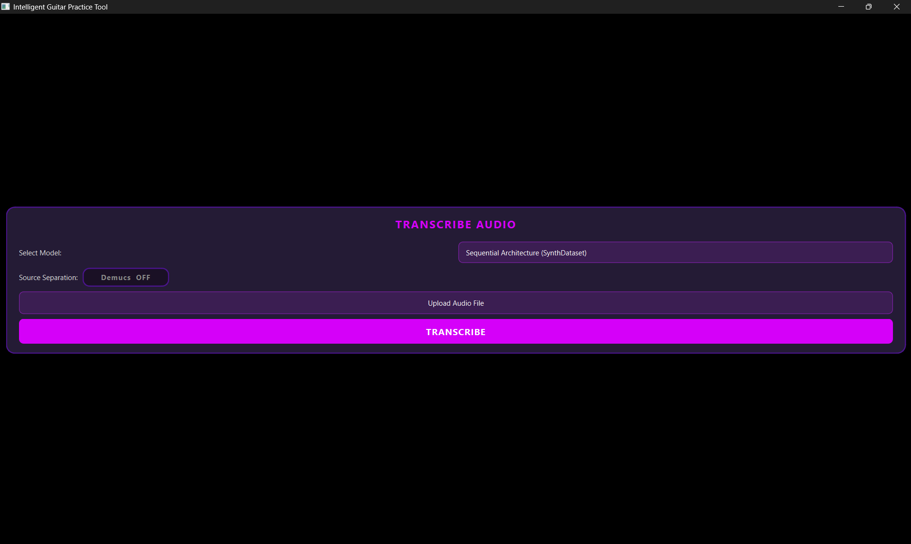
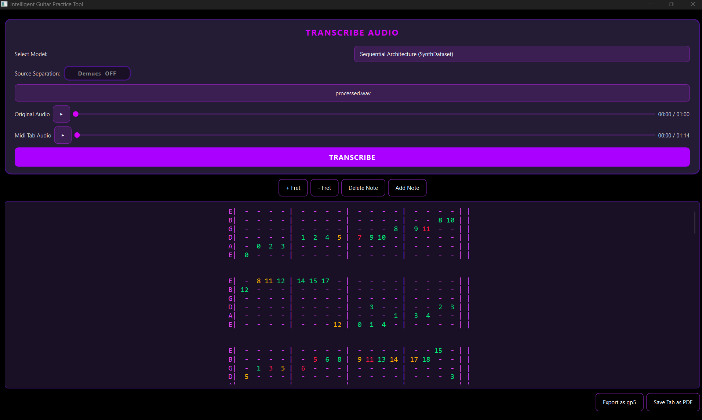
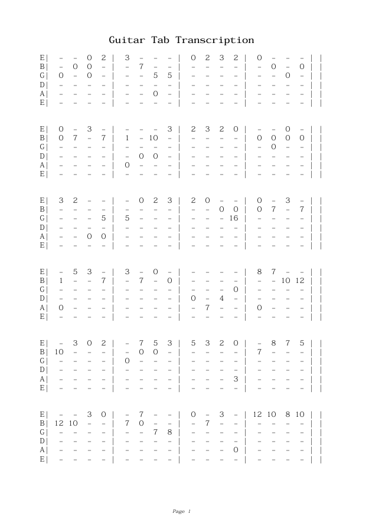
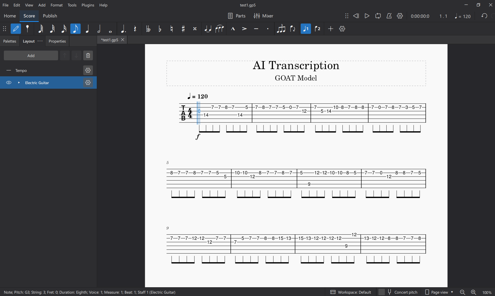

<div align="center">
  
  # Intelligent Guitar Practice Tool
  
  [](LICENSE)[](https://www.python.org/)
  
  Transcribes Audio into Guitar Tablature for guitar practice
  [Read the Full Dissertation](docs/dissertation.pdf)
  
  [Features](#features) • [Demo](#demo) • [Screenshots](#screenshots) • [Tech Stack](#tech-stack) • [Setup](#setup)
</div>


### Key Features
- Transcribes audio to guitar tablature
- Edit tabs easily
- Option to export to PDF or GP5
- 3 models to pick and try
- End-to-End includes confidence coloured tabs (Green - high, Amber - med, Red - low)


## Demo

## Screenshots





## Architecture


## Project Structure
```
intelligent-guitar-practice/
├── backend/
│   ├── analysis/              # Audio analysis and preprocessing
│   │   ├── audio_separation.py
│   │   └── note_filters.py
│   ├── core/                  # Core audio processing
│   │   ├── audio_loader.py
│   │   ├── harmonic_cqt.py
│   │   └── pitch_detector.py
│   ├── data/                  # Processed training data
│   │   ├── processed_test/
│   │   ├── labels/
│   │   └── specs/
│   ├── export/                # Tab export utilities
│   │   ├── exporter.py
│   │   ├── midi_exporter.py
│   │   ├── tab_parser.py
│   │   └── tab_pdf.py
│   └── models/                # ML models
│       ├── goat/              # end-to-end GOAT CNN model
│       │   ├── extract_goat.py
│       │   ├── goat_cnn.py
│       │   ├── goat_prediction.py
│       │   ├── goat_techniques.py
│       │   └── train_goat.py
│       └── synthtab/          # Sequential pipeline model
│           ├── extract_synthtab.py
│           ├── fretboard_cnn.py
│           ├── fretboard_mapper.py
│           ├── train.py
│           └── training_model.py
├── tablature/                 # Tab generation
│   ├── fretboard_mapper.py
│   └── tab_generator.py
├── evaluation/                # Model evaluation scripts
│   ├── evaluate_fretboard.py           # Evaluate SynthTab
|   ├── evaluate_fretboard_goat.py      # Evaluate GOAT CNN
│   └── ptich_evaluate.py      # Pitch detection evaluation
├── visualization              # Visualization graphs
|── main.py                    # Run CLI through here
├── docs/                      # Documentation and assets
├── outputs/                   # Generated outputs
├── resources/                 # Resource files
├── separated/                 # Audio separation outputs
└── run_app.py                # Run app from here
```

**Note:** Audio datasets (GuitarSet, GOAT dataset) and trained model weights are excluded due to size/copyright restrictions. Download instructions provided in [Setup](#setup)

## How to Setup
To run the desktop application on your device.  Follow these instructions:

1. Visit the [Release page](https://github.com/1102Aryan/intelligent-guitar-practice/releases).
2. Download the latest application: on Windows install .exe file, on MacOS install the zip file.
3. If zipped, extract it and then run.

To build from source code (for developers)
warning: requires python 3.10 to match the needs of all libraries

1. Clone the repository: `git clone https://github.com/1102Aryan/intelligent-guitar-practice.git`
2. Create a virtual environment: `python -venv venv`   
3. Activate the environment: `venv\Scripts\activate`
4. Install the required libraries: `pip install -r requirements.txt`
5. Run the application: `python .\run_app.py`


## Acknowledgments
- Big thanks to the creators of the dataset including GuitarSet, Synth dataset, GOAT dataset
- Special mention to [Spotify's Audio Intelligence Lab](https://research.atspotify.com/audio-intelligence/) for the library (Spotify Basic Pitch) used in this system. 


<div align="center">
  
  [Report Bug](https://github.com/1102Aryan/intelligent-guitar-practice/issues) • [Request Feature](https://github.com/1102Aryan/intelligent-guitar-practice/issues)
</div>


