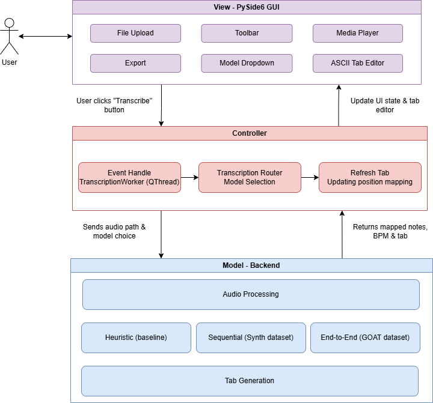

<div align="center">


# Intelligent Guitar Practice Tool

[](LICENSE)
[](https://www.python.org/)


Transcribe audio into guitar tablature for faster, more focused practice.


[Read the Full Dissertation](docs/Dissertation.pdf)
**[Download for Windows (.exe)](https://github.com/1102Aryan/intelligent-guitar-practice/releases/latest/download/IntelligentGuitarPractice-Setup.exe)**

</div>

---

## Overview

The Intelligent Guitar Practice Tool is a desktop application that transcribes guitar audio into playable tablature. It pairs a pitch detection front end with machine learning models that map detected notes onto the fretboard, then renders editable tabs that can be exported to PDF or Guitar Pro (GP5) format.

The project was developed as a final-year dissertation on automatic guitar music transcription. It offers three selectable transcription modes so the output can be compared across different approaches, and uses a traffic light confidence system to show how reliable each predicted note is.

## Table of Contents

- [Key Features](#key-features)
- [Demo](#demo)
- [Screenshots](#screenshots)
- [Architecture](#architecture)
- [Transcription Models](#transcription-models)
- [Results](#results)
- [Project Structure](#project-structure)
- [Setup](#setup)
- [Usage](#usage)
- [Built With](#built-with)
- [License](#license)
- [Acknowledgments](#acknowledgments)

## Key Features

- Transcribes guitar audio into tablature
- Three transcription models to choose from and compare
- In-app tab editing
- Export to PDF or Guitar Pro (GP5)
- Confidence-coloured tabs in end-to-end mode (green for high, amber for medium, red for low)
- Built-in MIDI playback of the transcribed result

## Demo

<div align="center">

[](https://youtu.be/PWJ_wfikSX0)

Watch the demonstration of the project 
</div>

## Screenshots

| Start Page | Confidence View |
| --- | --- |
|  |  |

| Exported Tab (PDF) | Transcribed Tab |
| --- | --- |
|  |  |

## Architecture

The application follows a Model-View-Controller structure separating audio processing, the machine learning models, and the GUI.



## Transcription Models

The tool provides three transcription modes that trade off accuracy, speed, and approach:

- **GOAT CNN (end-to-end):** a single convolutional model that maps audio directly to tablature. This mode produces the confidence-coloured output.
- **SynthTab (sequential pipeline):** pitch detection followed by a fretboard CNN that maps detected notes to string and fret positions.
- **Heuristic baseline:** a rule-based fretboard mapping used as a comparison point against the learned models.

Pitch detection is handled by Spotify Basic Pitch.

## Results

Evaluated on the GuitarSet benchmark:

| Stage | Metric | Result |
| --- | --- | --- |
| Pitch detection (Basic Pitch) | F1 | 0.833 |
| Fretboard mapping (SynthTab) | Exact-match accuracy | 60.3% |
| Fretboard mapping (heuristic baseline) | Exact-match accuracy | 49.6% |
| Full pipeline (GOAT CNN) | End-to-end accuracy | 17.4% |

## Project Structure

```
intelligent-guitar-practice/
├── backend/
│   ├── analysis/              # Audio analysis and preprocessing
│   │   ├── audio_separation.py
│   │   └── note_filters.py
│   ├── core/                  # Core audio processing
│   │   ├── audio_loader.py
│   │   ├── harmonic_cqt.py
│   │   └── pitch_detector.py
│   ├── data/                  # Processed training data
│   │   ├── processed_test/
│   │   ├── labels/
│   │   └── specs/
│   ├── export/                # Tab export utilities
│   │   ├── exporter.py
│   │   ├── midi_exporter.py
│   │   ├── tab_parser.py
│   │   └── tab_pdf.py
│   └── models/                # ML models
│       ├── goat/              # End-to-end GOAT CNN model
│       │   ├── extract_goat.py
│       │   ├── goat_cnn.py
│       │   ├── goat_prediction.py
│       │   ├── goat_techniques.py
│       │   └── train_goat.py
│       └── synthtab/          # Sequential pipeline model
│           ├── extract_synthtab.py
│           ├── fretboard_cnn.py
│           ├── fretboard_mapper.py
│           ├── train.py
│           └── training_model.py
├── tablature/                 # Tab generation
│   ├── fretboard_mapper.py
│   └── tab_generator.py
├── evaluation/                # Model evaluation scripts
│   ├── evaluate_fretboard.py        # Evaluate SynthTab
│   ├── evaluate_fretboard_goat.py   # Evaluate GOAT CNN
│   └── pitch_evaluate.py            # Pitch detection evaluation
├── visualization/             # Visualisation graphs
├── docs/                      # Documentation and assets
├── outputs/                   # Generated outputs
├── resources/                 # Resource files
├── separated/                 # Audio separation outputs
├── main.py                    # CLI entry point
└── run_app.py                 # Desktop app entry point
```

> **Note:** Audio datasets (GuitarSet, GOAT dataset) and trained model weights are excluded due to size and copyright restrictions. See [Setup](#setup) for download instructions.

## Setup

### Run the desktop application (end users)

1. Visit the [Releases page](https://github.com/1102Aryan/intelligent-guitar-practice/releases).
2. Download the latest build: the `.exe` installer on Windows, or the `.zip` on macOS.
3. If downloaded as a zip, extract it, then run the application.

### Build from source (developers)

> Requires Python 3.10 to match library compatibility.

1. Clone the repository:
   ```bash
   git clone https://github.com/1102Aryan/intelligent-guitar-practice.git
   cd intelligent-guitar-practice
   ```
2. Create a virtual environment:
   ```bash
   python -m venv venv
   ```
3. Activate the environment:
   ```bash
   # Windows
   venv\Scripts\activate

   # macOS / Linux
   source venv/bin/activate
   ```
4. Install dependencies:
   ```bash
   pip install -r requirements.txt
   ```
5. Run the application:
   ```bash
   python run_app.py
   ```

## Usage

1. Launch the application with `python run_app.py`.
2. Load an audio file containing guitar.
3. Select a transcription model (GOAT, SynthTab, or heuristic baseline).
4. Review the generated tab. In end-to-end mode, note colours indicate prediction confidence.
5. Edit the tab as needed, then export to PDF or GP5.

To run the command line interface instead, use `python main.py`.

## Built With

- Python 3.10
- PySide6 (desktop GUI)
- Spotify Basic Pitch (pitch detection)
- PyTorch / TensorFlow (model training and inference)
- librosa (audio processing)

## License

Distributed under the MIT License. See [LICENSE](LICENSE) for details.

## Acknowledgments

- The creators of the datasets used in this work: GuitarSet, the SynthTab dataset, and the GOAT dataset.
- [Spotify's Audio Intelligence Lab](https://research.atspotify.com/audio-intelligence/) for the Basic Pitch library used in the pitch detection stage.

<div align="center">

[Report Bug](https://github.com/1102Aryan/intelligent-guitar-practice/issues) • [Request Feature](https://github.com/1102Aryan/intelligent-guitar-practice/issues)

</div>
